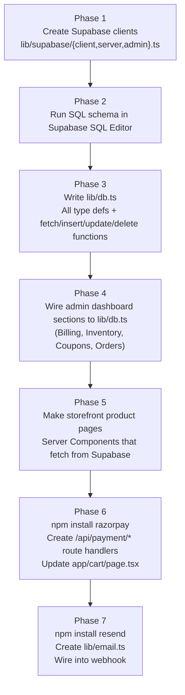

# Fashion-Store — Supabase Backend Implementation Plan
> Replacing localStorage with real Supabase DB · Multi-image products · Razorpay · Email

---

## Current State (what exists)

| Layer | Current | Target |
|---|---|---|
| Data store | `lib/store.ts` — 100% localStorage | Supabase PostgreSQL |
| Products | `ALL_PRODUCTS` static array in `app/products/page.tsx` | `products` table + `product_images` + `product_variants` |
| Orders | localStorage `shalistone_admin_v1` | `orders` + `order_items` tables |
| Coupons | localStorage | `coupons` table |
| Payments | Simulated Razorpay in `app/cart/page.tsx` | Real Razorpay API |
| Emails | None | Resend transactional email |
| Auth | None (admin is just `/admin`) | Supabase Auth + `profiles` table |
| Supabase | URL + keys in `.env.local`, client NOT set up | Full integration |

---

## Phase 1 — Supabase Client Setup

### 1.1 Install packages

```bash
npm install @supabase/supabase-js @supabase/ssr razorpay resend
```

### 1.2 Create `lib/supabase/client.ts`

```typescript
// Browser client — use in Client Components
import { createBrowserClient } from '@supabase/ssr';

export function createClient() {
  return createBrowserClient(
    process.env.NEXT_PUBLIC_SUPABASE_URL!,
    process.env.NEXT_PUBLIC_SUPABASE_ANON_KEY!
  );
}
```

### 1.3 Create `lib/supabase/server.ts`

```typescript
// Server client — use in Server Components, Route Handlers, Middleware
import { createServerClient } from '@supabase/ssr';
import { cookies } from 'next/headers';

export async function createClient() {
  const cookieStore = await cookies();
  return createServerClient(
    process.env.NEXT_PUBLIC_SUPABASE_URL!,
    process.env.NEXT_PUBLIC_SUPABASE_ANON_KEY!,
    { cookies: { getAll: () => cookieStore.getAll(), setAll: (c) => c.forEach(({ name, value, options }) => cookieStore.set(name, value, options)) } }
  );
}
```

### 1.4 Create `lib/supabase/admin.ts` (service-role — bypasses RLS)

```typescript
import { createClient } from '@supabase/supabase-js';

export const adminSupabase = createClient(
  process.env.NEXT_PUBLIC_SUPABASE_URL!,
  process.env.SUPABASE_SERVICE_ROLE_KEY!
);
```

---

## Phase 2 — Database Schema

Run this in Supabase SQL Editor. **This is the full schema for fashion-store** — adapted from your previous schema to add multi-image + variant support.

```sql
-- ==========================================
-- 1. PROFILES (admin auth)
-- ==========================================
CREATE TABLE IF NOT EXISTS profiles (
  id          UUID REFERENCES auth.users(id) PRIMARY KEY,
  email       TEXT UNIQUE NOT NULL,
  name        TEXT,
  mobile      TEXT,
  role        TEXT DEFAULT 'user',  -- 'admin' | 'user'
  created_at  TIMESTAMPTZ DEFAULT NOW()
);

-- ==========================================
-- 2. CATEGORIES
-- ==========================================
CREATE TABLE IF NOT EXISTS categories (
  name        TEXT PRIMARY KEY,
  created_at  TIMESTAMPTZ DEFAULT NOW()
);

-- ==========================================
-- 3. PRODUCTS
-- ==========================================
CREATE TABLE IF NOT EXISTS products (
  id            TEXT PRIMARY KEY,           -- e.g. 'cream-crewneck'
  name          TEXT NOT NULL,
  category      TEXT REFERENCES categories(name) ON UPDATE CASCADE,
  description   TEXT,
  price         INTEGER NOT NULL DEFAULT 0, -- base/display price in ₹
  image         TEXT,                       -- primary image URL (legacy, keep for now)
  is_new        BOOLEAN DEFAULT FALSE,
  discount_label TEXT,                      -- e.g. '-20%'
  is_available  BOOLEAN DEFAULT TRUE,
  created_at    TIMESTAMPTZ DEFAULT NOW()
);

-- ==========================================
-- 3a. PRODUCT IMAGES (multi-image support)
-- ==========================================
CREATE TABLE IF NOT EXISTS product_images (
  id          UUID DEFAULT gen_random_uuid() PRIMARY KEY,
  product_id  TEXT NOT NULL REFERENCES products(id) ON DELETE CASCADE,
  url         TEXT NOT NULL,
  alt_text    TEXT,
  sort_order  INTEGER DEFAULT 0,
  is_primary  BOOLEAN DEFAULT FALSE,
  created_at  TIMESTAMPTZ DEFAULT NOW()
);

CREATE UNIQUE INDEX IF NOT EXISTS idx_product_primary_image
  ON product_images(product_id) WHERE is_primary = TRUE;

-- ==========================================
-- 3b. PRODUCT VARIANTS (size + colour combos)
-- ==========================================
CREATE TABLE IF NOT EXISTS product_variants (
  id           UUID DEFAULT gen_random_uuid() PRIMARY KEY,
  product_id   TEXT NOT NULL REFERENCES products(id) ON DELETE CASCADE,
  size         TEXT,              -- e.g. 'S', 'M', 'L', 'XL', 'Free Size'
  color_name   TEXT,             -- e.g. 'Cream', 'Charcoal'
  color_hex    TEXT,             -- e.g. '#F5F2EB'
  price        INTEGER NOT NULL,
  stock        INTEGER DEFAULT 0,
  sku          TEXT,
  is_available BOOLEAN DEFAULT TRUE,
  sort_order   INTEGER DEFAULT 0,
  UNIQUE(product_id, size, color_name)
);

-- ==========================================
-- 4. COUPONS
-- ==========================================
CREATE TABLE IF NOT EXISTS coupons (
  code          TEXT PRIMARY KEY,
  discount_pct  INTEGER NOT NULL,    -- percentage off
  min_order     INTEGER DEFAULT 0,   -- minimum cart value in ₹
  expiry        DATE,
  usage_limit   INTEGER DEFAULT 100,
  used          INTEGER DEFAULT 0,
  is_active     BOOLEAN DEFAULT TRUE,
  created_at    TIMESTAMPTZ DEFAULT NOW()
);

-- ==========================================
-- 5. ORDERS
-- ==========================================
CREATE TABLE IF NOT EXISTS orders (
  id              TEXT PRIMARY KEY,        -- e.g. 'INV-2026-XXXXX'
  customer_name   TEXT,
  customer_phone  TEXT,
  customer_email  TEXT,
  customer_address TEXT,
  source          TEXT DEFAULT 'online',  -- 'online' | 'offline'
  subtotal        INTEGER DEFAULT 0,
  discount        INTEGER DEFAULT 0,
  coupon_code     TEXT REFERENCES coupons(code) ON DELETE SET NULL,
  delivery        INTEGER DEFAULT 0,
  total           INTEGER DEFAULT 0,
  amount_received INTEGER DEFAULT 0,
  status          TEXT DEFAULT 'pending', -- 'pending' | 'processing' | 'completed' | 'cancelled'
  razorpay_order_id   TEXT,
  razorpay_payment_id TEXT,
  created_at      TIMESTAMPTZ DEFAULT NOW()
);

CREATE TABLE IF NOT EXISTS order_items (
  id          UUID DEFAULT gen_random_uuid() PRIMARY KEY,
  order_id    TEXT NOT NULL REFERENCES orders(id) ON DELETE CASCADE,
  product_id  TEXT,
  name        TEXT NOT NULL,
  size        TEXT,
  color       TEXT,
  quantity    INTEGER NOT NULL DEFAULT 1,
  price       INTEGER NOT NULL          -- unit price in ₹
);

-- ==========================================
-- 6. DELIVERY REGIONS + TIERS (optional)
-- ==========================================
CREATE TABLE IF NOT EXISTS delivery_regions (
  id          UUID DEFAULT gen_random_uuid() PRIMARY KEY,
  name        TEXT NOT NULL UNIQUE,
  is_active   BOOLEAN DEFAULT TRUE,
  created_at  TIMESTAMPTZ DEFAULT NOW()
);

CREATE TABLE IF NOT EXISTS delivery_tiers (
  id              UUID DEFAULT gen_random_uuid() PRIMARY KEY,
  region_id       UUID NOT NULL REFERENCES delivery_regions(id) ON DELETE CASCADE,
  min_weight_g    INTEGER NOT NULL DEFAULT 0,
  max_weight_g    INTEGER,
  charge          INTEGER NOT NULL DEFAULT 0
);

-- ==========================================
-- 7. RLS POLICIES
-- ==========================================
ALTER TABLE profiles        ENABLE ROW LEVEL SECURITY;
ALTER TABLE categories      ENABLE ROW LEVEL SECURITY;
ALTER TABLE products        ENABLE ROW LEVEL SECURITY;
ALTER TABLE product_images  ENABLE ROW LEVEL SECURITY;
ALTER TABLE product_variants ENABLE ROW LEVEL SECURITY;
ALTER TABLE coupons         ENABLE ROW LEVEL SECURITY;
ALTER TABLE orders          ENABLE ROW LEVEL SECURITY;
ALTER TABLE order_items     ENABLE ROW LEVEL SECURITY;
ALTER TABLE delivery_regions ENABLE ROW LEVEL SECURITY;
ALTER TABLE delivery_tiers  ENABLE ROW LEVEL SECURITY;

-- Public storefront reads
CREATE POLICY "Public read categories"     ON categories      FOR SELECT USING (TRUE);
CREATE POLICY "Public read products"       ON products        FOR SELECT USING (is_available = TRUE);
CREATE POLICY "Public read images"         ON product_images  FOR SELECT USING (TRUE);
CREATE POLICY "Public read variants"       ON product_variants FOR SELECT USING (is_available = TRUE);
CREATE POLICY "Public read active coupons" ON coupons         FOR SELECT USING (is_active = TRUE);
CREATE POLICY "Public read delivery"       ON delivery_regions FOR SELECT USING (is_active = TRUE);
CREATE POLICY "Public read tiers"          ON delivery_tiers  FOR SELECT USING (TRUE);

-- Customers can insert their own orders
CREATE POLICY "Anyone can place order"     ON orders       FOR INSERT WITH CHECK (TRUE);
CREATE POLICY "Anyone can add items"       ON order_items  FOR INSERT WITH CHECK (TRUE);

-- Authenticated (admin) full access
CREATE POLICY "Admin all profiles"    ON profiles         FOR ALL USING (auth.role() = 'authenticated');
CREATE POLICY "Admin all categories"  ON categories       FOR ALL USING (auth.role() = 'authenticated');
CREATE POLICY "Admin all products"    ON products         FOR ALL USING (auth.role() = 'authenticated');
CREATE POLICY "Admin all images"      ON product_images   FOR ALL USING (auth.role() = 'authenticated');
CREATE POLICY "Admin all variants"    ON product_variants FOR ALL USING (auth.role() = 'authenticated');
CREATE POLICY "Admin all coupons"     ON coupons          FOR ALL USING (auth.role() = 'authenticated');
CREATE POLICY "Admin all orders"      ON orders           FOR ALL USING (auth.role() = 'authenticated');
CREATE POLICY "Admin all order items" ON order_items      FOR ALL USING (auth.role() = 'authenticated');
CREATE POLICY "Admin all delivery"    ON delivery_regions FOR ALL USING (auth.role() = 'authenticated');
CREATE POLICY "Admin all tiers"       ON delivery_tiers   FOR ALL USING (auth.role() = 'authenticated');
```

---

## Phase 3 — Data Layer (`lib/db.ts`)

This replaces `lib/store.ts` for all persistence. The old `lib/store.ts` is kept only for the remaining client-side UI state (cart items, current order state during checkout).

### Types

```typescript
export interface Product {
  id: string; name: string; category: string;
  description?: string; price: number; image?: string;
  isNew?: boolean; discountLabel?: string; isAvailable: boolean;
  images: ProductImage[];
  variants: ProductVariant[];
}

export interface ProductImage {
  id: string; productId: string; url: string;
  altText?: string; sortOrder: number; isPrimary: boolean;
}

export interface ProductVariant {
  id: string; productId: string;
  size?: string; colorName?: string; colorHex?: string;
  price: number; stock: number; isAvailable: boolean;
}

export interface Coupon {
  code: string; discountPct: number; minOrder: number;
  expiry?: string; usageLimit: number; used: number; isActive: boolean;
}

export interface OrderItem {
  productId?: string; name: string;
  size?: string; color?: string; quantity: number; price: number;
}

export interface Order {
  id: string; customerName?: string; customerPhone?: string;
  customerEmail?: string; customerAddress?: string;
  source: 'online' | 'offline'; subtotal: number;
  discount: number; couponCode?: string; delivery: number;
  total: number; amountReceived?: number;
  status: 'pending' | 'processing' | 'completed' | 'cancelled';
  razorpayOrderId?: string; razorpayPaymentId?: string;
  createdAt: string; items: OrderItem[];
}
```

### Key functions

```typescript
// Products
export const fetchProducts  = async (): Promise<Product[]>
export const fetchProductById = async (id: string): Promise<Product | null>
export const upsertProduct  = async (p: Product, imageFiles?: File[])
export const deleteProduct  = async (id: string)
export const setProductImages   = async (productId: string, images: Partial<ProductImage>[])
export const setProductVariants = async (productId: string, variants: Partial<ProductVariant>[])

// Coupons
export const fetchCoupons   = async (): Promise<Coupon[]>
export const upsertCoupon   = async (c: Coupon)
export const deleteCoupon   = async (code: string)
export const validateCoupon = async (code: string, subtotal: number): Promise<{ ok: boolean; discount: number; reason?: string }>
export const incrementCouponUsage = async (code: string)

// Orders
export const fetchOrders    = async (): Promise<Order[]>
export const insertOrder    = async (order: Order)
export const updateOrderStatus = async (id: string, status: string)
export const deleteOrder    = async (id: string)

// Invoice ID (sequential, reads from DB)
export const generateInvoiceId = async (): Promise<string>
  // reads MAX id from orders, increments, returns 'INV-2026-00042'
```

---

## Phase 4 — Wire Admin Dashboard to Supabase

These admin sections currently read/write only localStorage. Each needs to call `lib/db.ts` instead:

### `components/admin/sections/Billing.tsx`
- `createBill()` → calls `insertOrder(order)` from `lib/db.ts`
- `genInvoiceId()` → replaced by `await generateInvoiceId()` (sequential from DB)
- `evaluateCoupon()` → replaced by `await validateCoupon(code, subtotal)`
- Products in catalog modal → from `await fetchProducts()` not `useAdminData()`

### `components/admin/sections/Orders.tsx`
- Replace `useAdminData()` with `useEffect(() => fetchOrders().then(setOrders), [])`
- Delete order → calls `await deleteOrder(id)`
- Status update → calls `await updateOrderStatus(id, status)`

### `components/admin/sections/Inventory.tsx`
- Products → `await fetchProducts()`
- Stock adjust → `await updateProductVariant(variantId, { stock: newVal })`
- Add/Edit product → `await upsertProduct(product, imageFiles)`
- Delete → `await deleteProduct(id)`
- Multi-image uploader uploads to Supabase Storage bucket `product-images`

### `components/admin/sections/Coupons.tsx`
- All reads/writes → `fetchCoupons()`, `upsertCoupon()`, `deleteCoupon()`

### `components/admin/sections/Analytics.tsx`
- No change needed — already reads from `orders` state; just feed it from DB

---

## Phase 5 — Storefront Product Pages

### `app/products/page.tsx`
- Remove `ALL_PRODUCTS` static array
- Fetch from Supabase at build time (Server Component):

```typescript
// app/products/page.tsx  — make it a Server Component
import { createClient } from '@/lib/supabase/server';

export default async function ProductsPage() {
  const supabase = await createClient();
  const { data: products } = await supabase
    .from('products')
    .select('*, product_images(*), product_variants(*)')
    .eq('is_available', true)
    .order('created_at', { ascending: false });

  return <ProductGrid products={products} />;
}
```

### `app/product/page.tsx`
- Same — fetch by id/slug from Supabase
- Render **image gallery** (thumbnail strip) from `product_images`
- Render **variant selector** (size tabs + color swatches) from `product_variants`
- Selected variant determines the price shown

---

## Phase 6 — Razorpay Checkout

### 6.1 `app/api/payment/create-order/route.ts`

```typescript
import Razorpay from 'razorpay';
import { adminSupabase } from '@/lib/supabase/admin';

const rp = new Razorpay({
  key_id: process.env.RAZORPAY_KEY_ID!,
  key_secret: process.env.RAZORPAY_KEY_SECRET!,
});

export async function POST(req: Request) {
  const { orderId, amountInPaise, customerEmail, customerName } = await req.json();

  const rpOrder = await rp.orders.create({
    amount: amountInPaise,
    currency: 'INR',
    receipt: orderId,
    notes: { orderId, customerEmail, customerName },
  });

  // Attach razorpay_order_id to our order record
  await adminSupabase.from('orders')
    .update({ razorpay_order_id: rpOrder.id })
    .eq('id', orderId);

  return Response.json({ rpOrderId: rpOrder.id, key: process.env.NEXT_PUBLIC_RAZORPAY_KEY_ID });
}
```

### 6.2 `app/api/payment/webhook/route.ts`

```typescript
import crypto from 'crypto';
import { adminSupabase } from '@/lib/supabase/admin';
import { sendOrderConfirmationEmail } from '@/lib/email';

export async function POST(req: Request) {
  const body = await req.text();
  const sig  = req.headers.get('x-razorpay-signature')!;
  const hmac = crypto.createHmac('sha256', process.env.RAZORPAY_WEBHOOK_SECRET!)
                     .update(body).digest('hex');

  if (hmac !== sig) return new Response('Forbidden', { status: 403 });

  const { event, payload } = JSON.parse(body);

  if (event === 'payment.captured') {
    const p = payload.payment.entity;

    const { data: order } = await adminSupabase
      .from('orders')
      .update({ status: 'processing', razorpay_payment_id: p.id })
      .eq('razorpay_order_id', p.order_id)
      .select('id, customer_email')
      .single();

    if (order?.customer_email) {
      await sendOrderConfirmationEmail(order.id, order.customer_email);
    }
  }

  return Response.json({ ok: true });
}
```

### 6.3 `app/cart/page.tsx` changes

Replace the simulated payment block with:

```typescript
// 1. Insert order to Supabase with status 'pending'
const invoiceId = await generateInvoiceId();
await insertOrder({ id: invoiceId, ...orderData, status: 'pending' });

// 2. Get Razorpay order
const { rpOrderId, key } = await fetch('/api/payment/create-order', {
  method: 'POST',
  headers: { 'Content-Type': 'application/json' },
  body: JSON.stringify({ orderId: invoiceId, amountInPaise: total * 100, ... }),
}).then(r => r.json());

// 3. Open Razorpay modal (load script via useEffect)
const rzp = new (window as any).Razorpay({
  key,
  amount: total * 100,
  currency: 'INR',
  order_id: rpOrderId,
  name: 'Shalistone',
  description: `Order ${invoiceId}`,
  handler: () => router.push(`/order-success?id=${invoiceId}`),
  prefill: { name, email, contact: phone },
  theme: { color: '#0a0a0a' },
});
rzp.open();
```

> [!IMPORTANT]
> Webhook handles the actual DB update + email. The `handler` is **only** for UX navigation.

---

## Phase 7 — Transactional Email

### 7.1 `lib/email.ts`

```typescript
import { Resend } from 'resend';
import { adminSupabase } from './supabase/admin';

const resend = new Resend(process.env.RESEND_API_KEY);

export async function sendOrderConfirmationEmail(orderId: string, toEmail: string) {
  const { data: order } = await adminSupabase
    .from('orders')
    .select('*, order_items(*)')
    .eq('id', orderId)
    .single();

  await resend.emails.send({
    from: 'Shalistone <orders@shalistone.com>',
    to: toEmail,
    subject: `Your Order ${orderId} is Confirmed!`,
    html: buildOrderEmailHtml(order), // simple template function
  });
}
```

Add to `.env.local`:
```env
RESEND_API_KEY=re_xxxxxxxxxx
```

---

## Execution Order



---

## Files To Create / Modify

| File | Action |
|---|---|
| `lib/supabase/client.ts` | **Create** |
| `lib/supabase/server.ts` | **Create** |
| `lib/supabase/admin.ts` | **Create** |
| `lib/db.ts` | **Create** — full data layer |
| `lib/email.ts` | **Create** |
| `app/api/payment/create-order/route.ts` | **Create** |
| `app/api/payment/webhook/route.ts` | **Create** |
| `app/order-success/page.tsx` | **Create** |
| `app/products/page.tsx` | **Modify** — Server Component, fetch from DB |
| `app/product/page.tsx` | **Modify** — image gallery + variant selector |
| `app/cart/page.tsx` | **Modify** — real Razorpay flow |
| `components/admin/sections/Billing.tsx` | **Modify** — DB calls |
| `components/admin/sections/Inventory.tsx` | **Modify** — DB calls + multi-image |
| `components/admin/sections/Coupons.tsx` | **Modify** — DB calls |
| `components/admin/sections/Orders.tsx` | **Modify** — DB calls |
| `lib/store.ts` | **Keep but gut** — remove order/coupon/product logic, keep only cart UI state |
| `.env.local` | **Modify** — add `RESEND_API_KEY`, fill Razorpay keys |

---

## Notes

> [!NOTE]
> **Supabase Storage**: Create a `product-images` bucket (Public) in Supabase Dashboard → Storage before implementing the inventory image uploader.

> [!WARNING]
> **`lib/store.ts` currently drives the entire admin panel.** Don't delete it all at once — migrate section by section (Coupons first, then Inventory, then Billing, then Orders) to avoid breaking everything simultaneously.

> [!TIP]
> **Start with Phase 1–3** (clients + schema + db.ts) — this is pure setup with zero UI changes. Then tackle each admin section one at a time.
